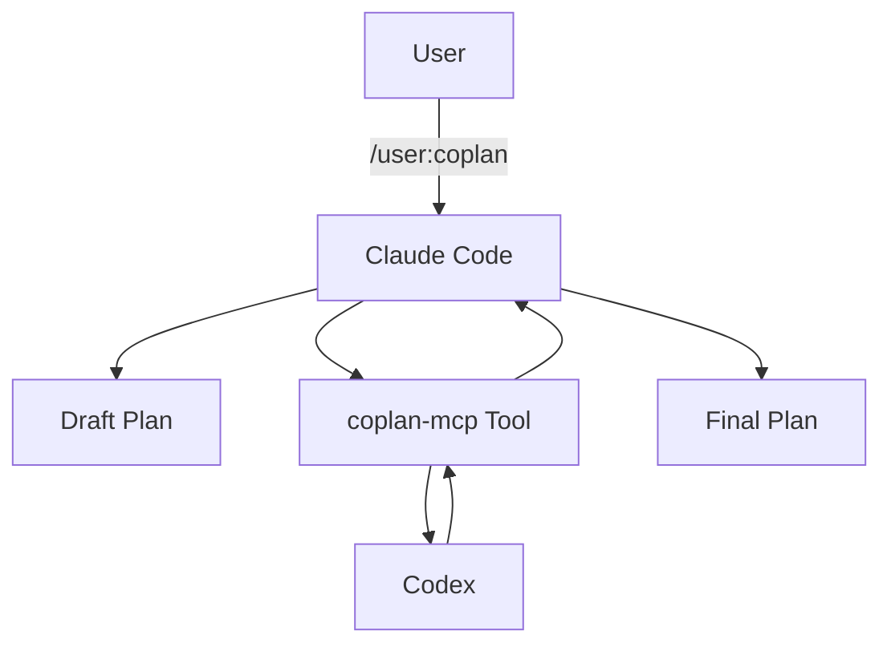

# Diagram

```mermaid
flowchart TD
U["User"] -->|"/user:coplan"| CC["Claude Code"]
CC --> PLAN["Draft Plan"]
CC --> MCP["coplan-mcp Tool"]
MCP --> CODEX["Codex"]
CODEX --> MCP
MCP --> CC
CC --> FINAL["Final Plan"]
```

